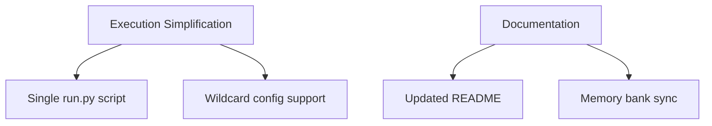

# Active Development Context - TTRPG Agent Simulation

**Last Updated:** 2025-04-28

## Current Focus Areas
1. Simplified execution workflow
2. JSON configuration system
3. CLI interface improvements
4. Documentation standardization

## Recent Technical Changes

## Next Steps
- Implement user-directed scene transitions
- Add conversation history export
- Develop GUI interface prototype
